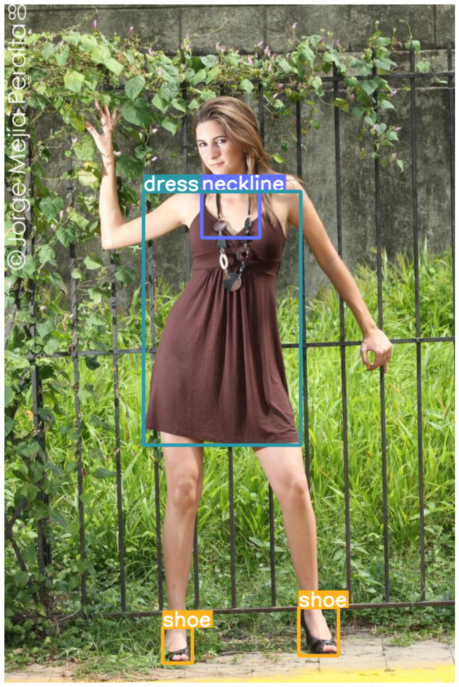

# Fashionpedia object detection with Azure Automl 

## Introduction

Fashionpedia is a dataset which consists of two parts: 

- an ontology built by fashion experts containing 27 main apparel categories, 19 apparel parts, 294 fine-grained attributes and their relationships; 
- a dataset with 48k every day and celebrity event fashion images annotated with segmentation masks and their associated per-mask fine-grained attributes, built upon the Fashionpedia ontology.

See: https://fashionpedia.github.io/home/index.html

The objective of this project is to use the object detection feature of Azure automl to create a model for fashion detection 




## Download of data 

### Images

- Training images can be downloaded at: https://s3.amazonaws.com/ifashionist-dataset/images/train2020.zip
- Validation and test images can be downloaded at: https://s3.amazonaws.com/ifashionist-dataset/images/val_test2020.zip

Images have been downloaded, unzipped and load in the default dataset associated with our Azure ML workspace at the path `"lab-data/fashionpedia/train"` and `"lab-data/fashionpedia/test"`

### Annotations: 

Annotations are stored in json files 

- Train: https://s3.amazonaws.com/ifashionist-dataset/annotations/instances_attributes_train2020.json
- Validation: https://s3.amazonaws.com/ifashionist-dataset/annotations/instances_attributes_val2020.json
- Test: https://s3.amazonaws.com/ifashionist-dataset/annotations/info_test2020.json

Format of these files can be found at: 

https://github.com/cvdfoundation/fashionpedia?tab=readme-ov-file#images


## Authentication 

The following env variable must be set in an `.env` file in the root of the project:


```
AZURE_SUBSCRIPTION_ID=<your subscription ID>
AZURE_RESOURCE_GROUP=<name of the resource group of Azure ML>
AZURE_WORKSPACE=azure=<name of the workspace>
AZURE_TENANT_ID=<your tenant ID>
AZURE_CLIENT_ID=<client ID of the service principal associated with your workspace>
AZURE_CLIENT_SECRET=<client secret of the service principal associated with your workspace>
```


